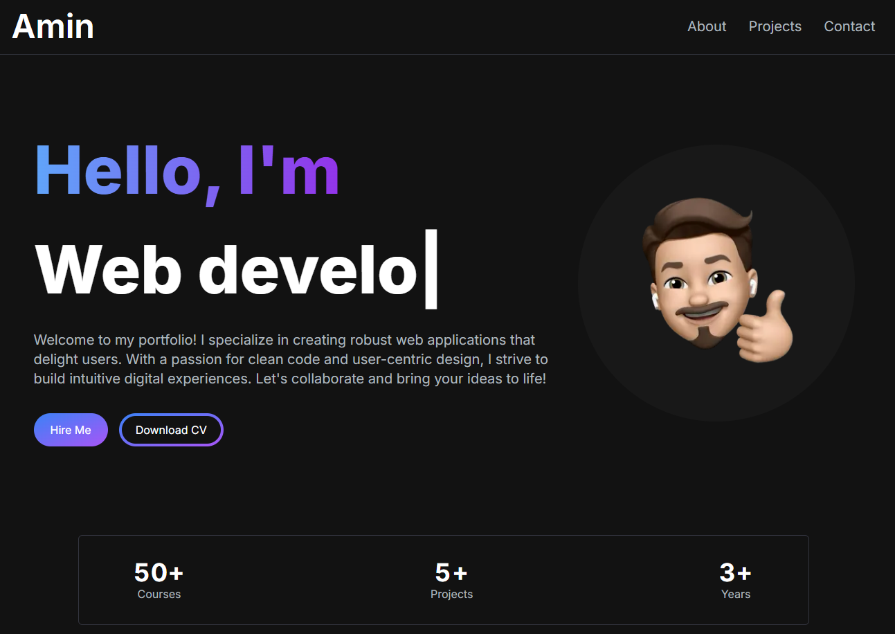
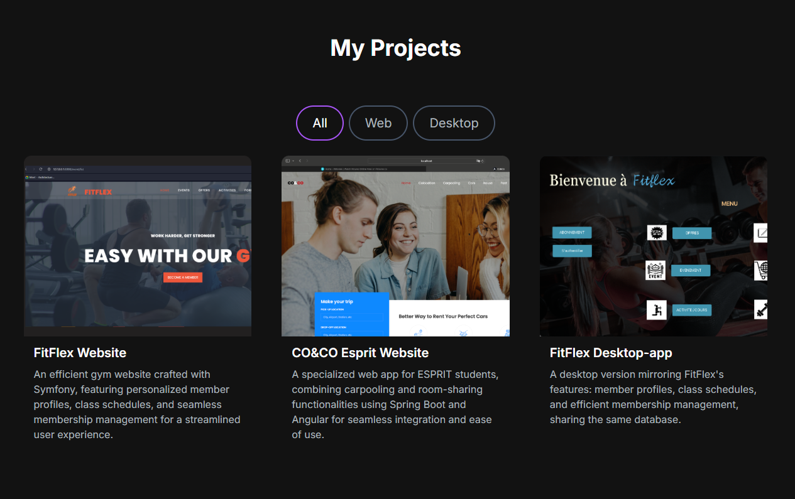
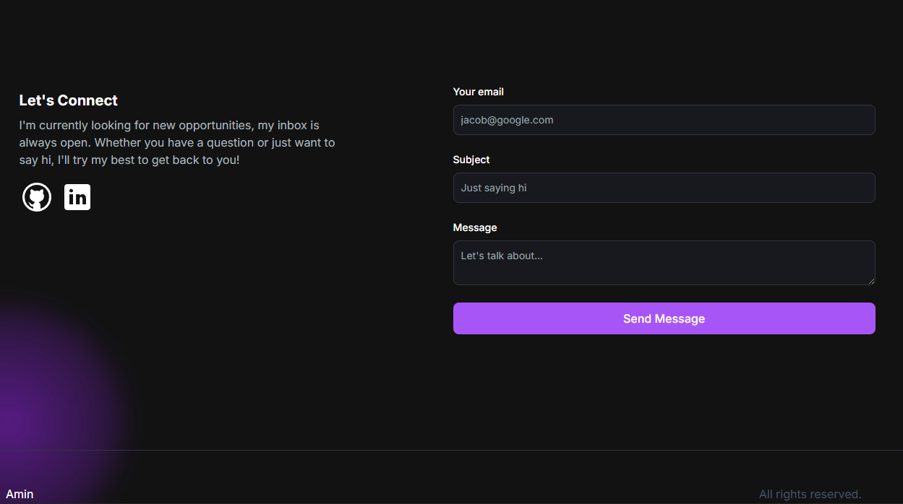

# Portfolio Website

This is a portfolio website built with Next.js and Tailwind CSS. It showcases your skills, projects, and achievements in an elegant and responsive design.

## Table of Contents
- [Installation](#installation)
- [Usage](#usage)
- [Dependencies](#dependencies)
- [Screenshots](#screenshots)
- [Contributing](#contributing)

## Installation

1. Clone the repository: `git clone https://github.com/aminmguidich/Amin-portfolio.git`
2. Navigate to the project directory: `cd Amin-portfolio`
3. Install the dependencies: `npm install`

## Usage

1. Start the development server: `npm run dev`
2. Open your browser and visit `http://localhost:3000` to view the website.

## Dependencies

The following dependencies are required for this project:

- Next.js: A React framework for server-side rendering and static site generation.
- Tailwind CSS: A highly customizable CSS framework.
- React: A JavaScript library for building user interfaces.
- React Icons: A collection of popular icons for React projects.
- TypeScript: A typed superset of JavaScript that compiles to plain JavaScript.
- Resend: Resend is the email API for developers.

## Screenshots

### Home Page

### Projects Section

### Contact Section

## Deployed URL

Check out the live version of the portfolio website [here](https://amiin.vercel.app/).
